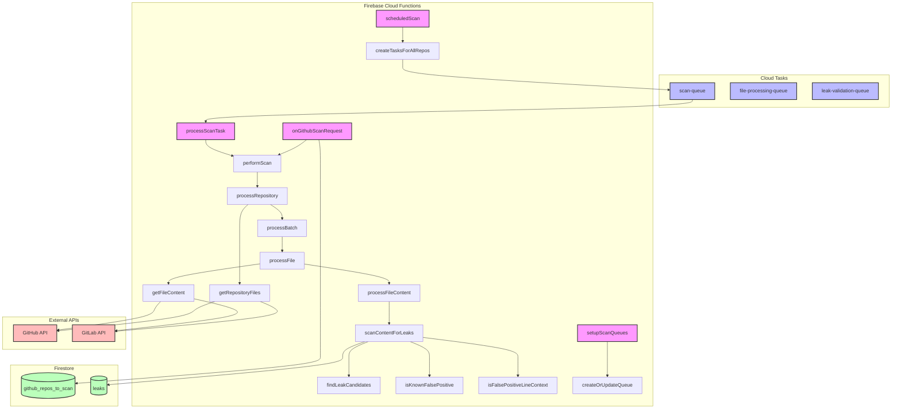
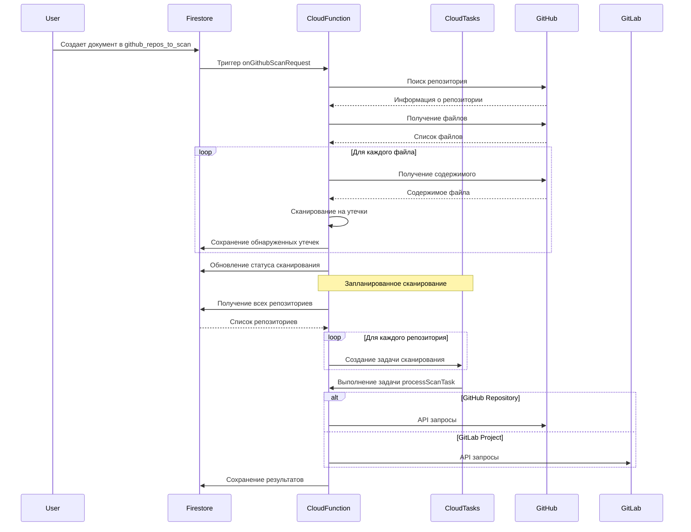

# Архитектура Leak Lookout

## Диаграмма компонентов



## Диаграмма последовательности



## Диаграмма развертывания

```mermaid
graph TD
    subgraph "Google Cloud Platform"
        subgraph "Firebase"
            A[Cloud Functions]
            B[Firestore]
            C[Secret Manager]
        end
        
        subgraph "Cloud Tasks"
            D[Очереди задач]
        end
        
        subgraph "Cloud Scheduler"
            E[Запланированные задачи]
        end
    end
    
    subgraph "External Services"
        F[GitHub API]
        G[GitLab API]
    end
    
    E --> A
    A --> B
    A --> C
    A --> D
    D --> A
    A --> F
    A --> G
    
    style A fill:#f9f,stroke:#333,stroke-width:2px
    style B fill:#bbf,stroke:#333,stroke-width:2px
    style C fill:#bbf,stroke:#333,stroke-width:2px
    style D fill:#bfb,stroke:#333,stroke-width:2px
    style E fill:#bfb,stroke:#333,stroke-width:2px
    style F fill:#fbb,stroke:#333,stroke-width:2px
    style G fill:#fbb,stroke:#333,stroke-width:2px
