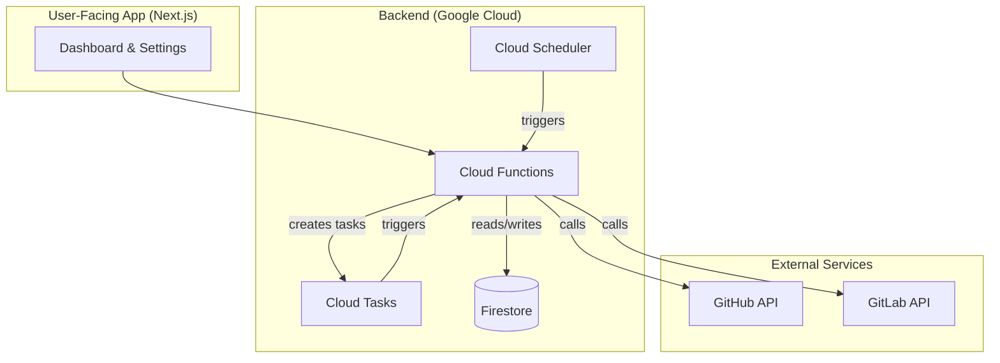

# System Patterns & Architecture

This document describes the architecture of the Leak-Lookout application, covering both the frontend and backend systems.

## High-Level Architecture
The application follows a modern web architecture with a decoupled frontend and a serverless backend.

- **Frontend**: A Next.js application provides the user interface, including the dashboard, leak details, and settings pages. It interacts with the backend via Firebase SDKs and potentially direct API calls to Firebase Functions.
- **Backend**: The backend is built entirely on Google Cloud Platform, leveraging Firebase services for core functionality. It's designed as a set of event-driven, serverless functions.

## Backend Architecture: Firebase & Google Cloud
The backend is responsible for scanning repositories for leaks. It's a sophisticated system that uses several cloud services in concert.

### Key Components & Flows
1.  **Scan Initiation**: Scans can be triggered in two ways:
    - **Manually/On-demand**: A user action in the frontend creates a document in the `github_repos_to_scan` collection in Firestore, which triggers the `onGithubScanRequest` function.
    - **Scheduled**: A Cloud Scheduler job runs at regular intervals, triggering a function that creates scan tasks for all registered repositories.

2.  **Asynchronous Task Processing**: To handle potentially long-running scans, the system uses Google Cloud Tasks.
    - A main function dispatches individual repository scan jobs to a `scan-queue`.
    - Worker functions, triggered by messages from the queue, perform the actual scanning. This pattern allows for scalability, retries, and avoids function timeouts.

3.  **Scanning Process**:
    - A worker function fetches the list of files for a given repository from the GitHub or GitLab API.
    - It then processes files in batches, fetching their content.
    - The content of each file is passed through a `leakDetector` module, which scans for patterns matching secrets, API keys, etc.
    - Discovered leaks are written to a `leaks` collection in Firestore.

4.  **AI Integration (Genkit)**: The `src/ai` directory contains flows managed by Genkit. These are likely used for post-processing tasks, such as:
    - **Validating a leaked key**: Checking if a discovered key is active.
    - **Generating remediation steps**: Providing users with instructions on how to fix a leak.
    - **Enhancing context**: Adding more information to a discovered leak.

## Frontend Architecture
The frontend is a standard Next.js application using the App Router.
- **Structure**: Code is organized into `app` for pages, `components` for reusable UI elements, `lib` for utilities, and `hooks` for custom React hooks.
- **State Management**: Component-level state is managed with `useState` and `useReducer`. For cross-component state, React Context is likely used (e.g., `AppProviders.tsx`). For server state and data fetching, custom hooks like `useLeaks.ts` are used, which probably wrap Firebase's Firestore SDK.
- **Styling**: Tailwind CSS is used for styling, with `clsx` and `tailwind-merge` for managing conditional and combined classes.
